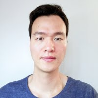

---
# You don't need to edit this file, it's empty on purpose.
# Edit whiteglass' home layout instead if you want to make some changes.
# See: https://jekyllrb.com/docs/themes/#overriding-theme-defaults
layout: home
---

<!--## Sungjin Ahn-->

 
Associate Professor  
[School of Computing](https://cs.kaist.ac.kr)  
[KAIST](https://kaist.ac.kr)
<!-- Assistant Professor (on leave), [Department of Computer Science](https://cs.rutgers.edu)   
[Center for Cognitive Science](https://ruccs.rutgers.edu/), [Rutgers University](https://www.rutgers.edu)    -->
<!-- 
Assistant Professor
[Department of Computer Science](https://cs.rutgers.edu)  
[Center for Cognitive Science](https://ruccs.rutgers.edu/)  
[Rutgers University](https://www.rutgers.edu)    -->
  
  
 
 

I'm an Associate Professor in the [School of Computing](https://cs.kaist.ac.kr) at [KAIST](https://kaist.ac.kr) and also an Assistant Professor of Computer Science at Rutgers University, affiliated with the Rutgers Center for Cognitive Science. I lead the [Agent and Machine Learning Lab](http://www.sungjinahn.com) at KAIST and Rutgers. My research interest is to develop machine learning algorithms to make human-like general-purposed intelligent agents. In pursuing this, I'm particularly interested in learning representations, world models, and policies in interactive, self-supervised, and structured ways (e.g., causal, compositional, temporal, and hierarchical) with the tools of deep learning, reinforcement learning, and probabilistic learning. I also enjoy being inspired by Cognitive Science to discover novel problems and inductive biases. I received my Ph.D. at the [University of California, Irvine](https://uci.edu) on the study of scalable approximate Bayesian inference under the supervision of Prof. [Max Welling](https://staff.fnwi.uva.nl/m.welling/). I did my postdoc working on deep learning at [MILA](https://mila.quebec/en/) under Prof. [Yoshua Bengio](https://yoshuabengio.org/). 

**Email**: sjn.[last_name] at gmail  
**Address**: E3-1 Rm:3435, KAIST, 291 Daehak-ro, Yuseong-gu, Daejeon, South Korea

### **Research Interest**   
- Machine Learning for General-Purpose Agents and Intelligent Robots    
- Learning Representations, World Models, and Policies    
- Unsupervised and Structured (causal, compositional, temporal, hierarchical) Learning    

### **Openings**   
- I'm looking for highly motivated students in all degree programs, Ph.D., M.S., and Undergraduate. If you're interested in researching on machine learning for intelligent agents, please send me an email with your CV and transcript.      

### **News**    
- Co-organizing [ICLR 22 Workshop on the Elements of Reasoning: Objects, Structure and Causality](https://objects-structure-causality.github.io/). 
- "ROOTS: Object-Centric Representation and Rendering for 3D Scenes" is accepted in the Journal of Machine Learning Research  
- Two papers are accepted in ICML 2021  
- Invited Talk at DeepMind, Jan 2021  
- Our paper "Generative Neurosymbolic Machines" is accepted in NeurIPS 2020 as a spotlight!  
- Invited Speaker for [NeurIPS 2020 Workshop on Object Representations for Learning and Reasoning](https://orlrworkshop.github.io/index.html)  
- Co-organizing ICML 2020 Workshop on Object-Oriented Learning ([https://oolworkshop.github.io/](https://oolworkshop.github.io/))
- Teaching in Fall 2020: [CS 444: Deep Learning](https://hackmd.io/@Tn97A1U0QG6gBtFPXRh4oQ/rkkT1AT_I)
<!--- A postdoc position is available. For more information, send me an email with your CV.   -->
<!--- I'm serving as an Area Chair for UAI 2020-->
- 2 papers accepted in ICLR 2020
- Teaching [CS 536: Machine Learning](https://hackmd.io/@Tn97A1U0QG6gBtFPXRh4oQ/B1sZLO55r) in Spring 2020
- 3 papers accepted in NeurIPS 2019 including one spotlight paper
<!--- A paper on Single-View 3D Learning with Adversarial Training is accepted to ICCV 2019 as an oral presentation-->
<!--- New paper on Sequential Neural Processes is in arXiv-->

### **Service** 
- Area Chair - NeurIPS(21), ICML(21,22), AAAI(21,22)
- Reviewers - NeurIPS, ICML, ICLR, AISTATS, AAAI (2015 - 2020)   

### **Publications** / [Google Scholar](https://scholar.google.com/citations?user=nfHyDeUAAAAJ&hl)  

### 2022    

Illiterate DALLE Learns to Compose    
Gautam Singh, Fei Deng, Sungjin Ahn    
ICLR 22 [[pdf](https://arxiv.org/pdf/2110.11405.pdf)] [[project](https://sites.google.com/view/slate-autoencoder)]  [[code](https://github.com/singhgautam/slate)] 

### 2021      

DreamerPro: Reconstruction-Free Model-Based Reinforcement Learning with Prototypical Representations      
Fei Deng, Ingook Jang, Sungjin Ahn      
[[arXiv](https://arxiv.org/abs/2110.14565)]     

Structured World Belief for Reinforcement Learning in POMDP             
Gautam Signh, Skand Peri, Junghyun Kim, Hyunseok Kim, Sungjin Ahn  
ICML 21 [[pdf](http://proceedings.mlr.press/v139/singh21a/singh21a.pdf)]    

Generative Video Transformer: Can Objects be the Words?  
Yi-Fu Wu, Jaesik Yoon, Sungjin Ahn  
ICML 21 [[pdf](http://proceedings.mlr.press/v139/wu21h/wu21h.pdf)]  

Generative Scene Graph Networks  
F. Deng, Z. Zhi, D. Lee, S. Ahn  
ICLR 21 [[pdf](https://openreview.net/pdf?id=RmcPm9m3tnk)]   

ROOTS: Object-Centric Representation and Rendering of 3D Scenes      
{C. Chen, F. Deng}, S. Ahn  
JMLR 21, [[pdf](https://www.jmlr.org/papers/v22/20-1176.html)] [[project](https://sites.google.com/view/roots3d)] <!--- [[code]()]    -->     

### 2020

Generative Neurosymbolic Machines  
J. Jiang and S. Ahn  
NeurIPS 20, [[arxiv](https://arxiv.org/abs/2010.12152)] [[code](https://github.com/JindongJiang/GNM)] Spotlight (top 4% = 395/9454 submissions)    

Improving Generative Imagination in Object-Centric World Models  
Z. Lin, Y. Wu, S. Peri, B. Fu, J. Jiang, S. Ahn  
ICML 20 [[pdf](http://proceedings.mlr.press/v119/lin20f.html)] [[project](https://sites.google.com/view/gswm/home)] [[code](https://github.com/zhixuan-lin/G-SWM)]   

Robustifying Sequential Neural Processes    
J. Yoon, G. Singh, and S. Ahn   
ICML 20 [[arxiv](https://arxiv.org/abs/2006.15987)]   <!--- [[project]()] [[code]()]   -->  

SCALOR: Generative World Models with Scalable Object Representations     
{J. Jiang, S. Janghorbani}, G. Melo, and S. Ahn  
ICLR-20 [[arxiv](https://arxiv.org/abs/1910.02384)] [[project](https://sites.google.com/view/scalor/home)] [[code](https://github.com/JindongJiang/SCALOR)]      

SPACE: Unsupervised Object-Oriented Scene Representation via Spatial Attention and Decomposition    
{Z. Lin, Y. Wu, S. Peri}, W. Sun, G. Singh, F. Deng, J. Jiang, S. Ahn  
ICLR 20 [[pdf](https://openreview.net/pdf?id=rkl03ySYDH)] [[project](https://sites.google.com/view/space-project-page)] [[code](https://github.com/JindongJiang/SCALOR)]  

Hierarchical Decomposition and Generation of Scenes with Compositional Objects   
F. Deng, Z. Zhi, S. Ahn  
ICML 20, Workshop on Object-Oriented Learning Spotlight [[pdf](https://github.com/oolworkshop/oolworkshop.github.io/blob/master/pdf/OOL_30.pdf)]   

Generating Stochastic Object Dynamics in Scenes  
Z. Lin, Y. Wu, S. Peri, B. Fu, J. Jiang, and S. Ahn   
ICML 20, Workshop on Object-Oriented Learning [[pdf](https://github.com/oolworkshop/oolworkshop.github.io/blob/master/pdf/OOL_3.pdf)]  

<!-- Space and the Brain - A Review of the Cognitive Map Mechanisms in the Entorhinal-Hippocampal Circuit  
Y. Friedman and S. Ahn   
Henry Rutgers Scholar Award           -->

### 2019

Sequential Neural Processes   
{G. Singh, J. Yoon}, Y. Sohn, and S. Ahn    
NeurIPS 19, Spotlight (top 2.4% = 164/6743)  
[[pdf](https://arxiv.org/pdf/1906.10264.pdf)] [[project](https://sites.google.com/view/sequential-neural-processes)] [[code](https://github.com/singhgautam/snp)]

Variational Temporal Abstraction  
T. Kim, {S. Ahn, Y. Bengio}  
NeurIPS 19

Neural Multisensory Scene Inference  
J. Lim, P. Pinheiro, N. Rostamzadeh, C. Pal, and S. Ahn  
NeurIPS 19

Learning Single-View 3D Reconstruction with Adversarial Training   
P. Pinheiro, N. Rostamzadeh, and S. Ahn  
ICCV 19, Oral (top 4.3% of all the submitted)

Generative Hierarchical Models for Parts, Objects, and Scenes  
F. Deng, Z. Zhi, and S. Ahn  
arXiv

Reinforced Imitation in Heterogeneous Action Space  
K. Zolna, N. Rostamzadeh, Y. Bengio, {S. Ahn, P. O. Pinheiro}  
arXiv

### 2018

Bayesian Model-Agnostic Meta-Learning  
{J Yoon, T Kim}, O. Dia, S. Kim, Y. Bengio, S. Ahn  
NeurIPS 18, Spotlight (top 3.5% = 168/4856)

Reinforced Imitation Learning from Observations  
K. Żołna, N. Rostamzadeh, Y. Bengio, {S. Ahn, P. Pinheiro}  
NeurIPS 18 Workshop on Imitation Learning and Its Challenges in Robotics

### 2017

Hierarchical Multiscale Recurrent Neural Networks  
J. Chung, S. Ahn, Y. Bengio  
ICLR 17   
<!--International Conference on Learning Representations (ICLR)-->

Denoising Criterion for Variational Auto-Encoding Framework  
D. Im, S. Ahn, R. Memisevic, Y. Bengio  
AAAI 17   
<!--Conferenceon Artificial Intelligence (AAAI)-->

SENA: Preserving Social Structure for Network Embedding  
S. Hong, T. Chakraborty, S. Ahn, G. Husari and N. Park  
ACM Hypertext and Social Media 17  

### 2016

Pointing the Unknown Words  
C. Gulcehre, S. Ahn, R. Nallapati, B. Zhou, Y. Bengio  
ACL 16 Oral Presentation    

Generating Factoid Questions with Recurrent Neural Networks: The 30M Factoid Question-Answer Corpus  
{I. V. Serban, A. G. Duran}, C. Gulcehre, S. Ahn, S. Chandar, A. Courville, Y. Bengio  
ACL 16

Scalable MCMC for Mixed Membership Stochastic Blockmodels  
{W. Li, S. Ahn}, and M. Welling   
AISTATS 16

Scalable Overlapping Community Detection   
I. El-Helw, R. Hofman, W. Li, S. Ahn, M. Welling, H. Bal       
ParLearning 16, Best Paper Award

Learning Latent Multiscale Structure using Recurrent Neural Networks  
J. Chung, S. Ahn, Y. Bengio  
NIPS 16 Workshop on Neural Abstract Machines & Program Induction (NAMPI)

A Neural Knowledge Language Model  
S. Ahn, H. Choi, T. Parnamaa, Y. Bengio   
arXiv

Hierarchical Memory Networks  
S. Chandar, S. Ahn, H. Larochelle, P. Vincent, G. Tasauro, Y. Bengio    
arXiv

### ~2015 (selected publications)

Stochastic Gradient MCMC: Algorithms and Applications  
PhD Dissertation

Large-Scale Distributed Bayesian Matrix Factorization using Stochastic Gradient MCMC  
S. Ahn, A. Korattikara, N. Liu, S. Rajan, and M. Welling  
KDD 15

Distributed Stochastic Gradient MCMC  
S. Ahn, B. Shahbaba, and M. Welling  
ICML 14

Distributed and Adaptive Darting Monte Carlo through Regenerations  
S. Ahn, Y. Chen, and M. Welling  
AISTATS 13

Bayesian Posterior Sampling via Stochastic Gradient Fisher Scoring  
S. Ahn, A. Korattikara, and M. Welling  
ICML 12 Best Paper Award

